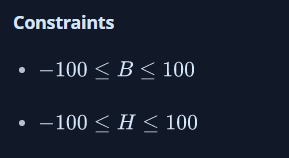

# Java Static Initializer Block

Static initialization blocks are executed when the class is loaded, and you can initialize static variables in those blocks.

It's time to test your knowledge of Static initialization blocks. You can read about it here.

You are given a class Solution with a main method. Complete the given code so that it outputs the area of a parallelogram with breadth B and height H . You should read the variables from the standard input.

If B<_ 0 or H<_ 0  , the output should be "java.lang.Exception: Breadth and height must be positive" without quotes.

### Input Format

There are two lines of input. The first line contains B : the breadth of the parallelogram. The next line contains H: the height of the parallelogram.

### Output Format

If both values are greater than zero, then the main method must output the area of the parallelogram. Otherwise, print "java.lang.Exception: Breadth and height must be positive" without quotes.

Sample input 1: -

1

3

Sample output 1: -

3

Sample input 2: -

-1

2

Sample output 2: -

java.lang.Exception: Breadth and height must be positive