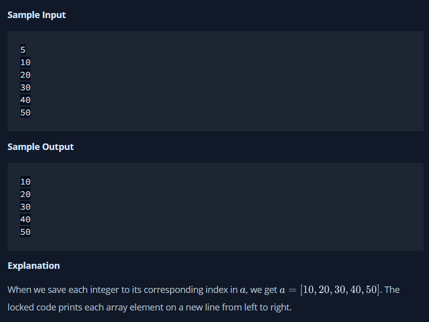
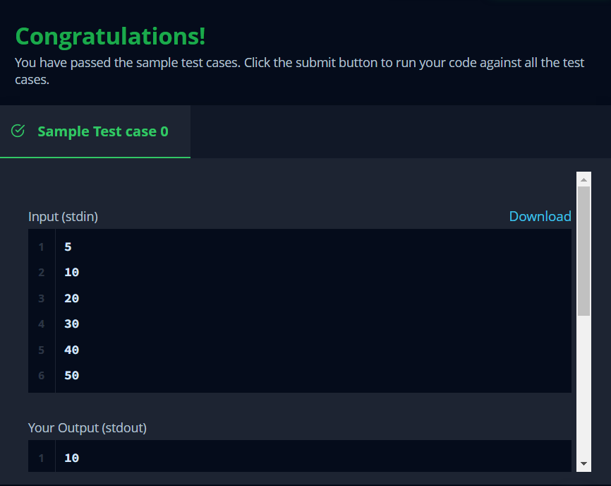

# Java 1D Array

An array is a simple data structure used to store a collection of data in a contiguous block of memory. Each element in the collection is accessed using an index, and the elements are easy to find because they're stored sequentially in memory.

Because the collection of elements in an array is stored as a big block of data, we typically use arrays when we know exactly how many pieces of data we're going to have. For example, you might use an array to store a list of student ID numbers, or the names of state capitals. To create an array of integers named my Array that can hold four integer values, you would write the following code:

int[] myArray = new int[4];

This sets aside a block of memory that's capable of storing 4 integers. Each integer storage cell is assigned a unique index ranging from 0 to one less than the size of the array, and each cell initially contains a 0. In the case of myArray, we can store integers at indices , , , and . Let's say we wanted the last cell to store the number ; to do this, we write:

myArray[3] = 12;
Similarly, we can print the contents of the last cell with the following code:

System.out.println(myArray[3]);
The code above prints the value stored at index  of , which is  (the value we previously stored there). It's important to note that while Java initializes each cell of an array of integers with a , not all languages do this.

Task

The code in your editor does the following:

Reads an integer from stdin and saves it to a variable, , denoting some number of integers.
Reads  integers corresponding to  from stdin and saves each integer  to a variable, .
Attempts to print each element of an array of integers named .
Write the following code in the unlocked portion of your editor:

Create an array, , capable of holding  integers.
Modify the code in the loop so that it saves each sequential value to its corresponding location in the array. For example, the first value must be stored in , the second value must be stored in , and so on.
Good luck!

Input Format

The first line contains a single integer, , denoting the size of the array.
Each line  of the  subsequent lines contains a single integer denoting the value of element .

Output Format

You are not responsible for printing any output to stdout. Locked code in the editor loops through array  and prints each sequential element on a new line.

