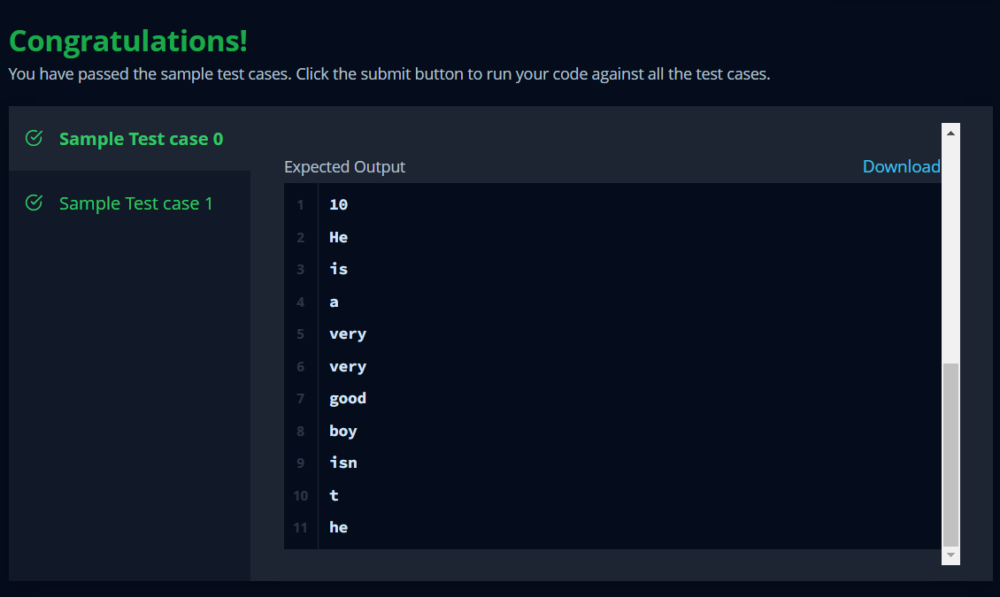

# Java String Tokens
Given a string, S, matching the regular expression [A-Za-z !,?._'@]+, split the string into tokens. We define a token to be one or more consecutive English alphabetic letters. Then, print the number of tokens, followed by each token on a new line.

Note: You may find the String.split method helpful in completing this challenge.

#### Input Format -

A single string, S.

#### Output Format - 

On the first line, print an integer, n, denoting the number of tokens in string s (they do not need to be unique). Next, print each of the n tokens on a new line in the same order as they appear in input string s.

#### Sample Input

He is a very very good boy, isn't he?

#### Sample Output

10
He
is
a
very
very
good
boy
isn
t
he

Explanation

We consider a token to be a contiguous segment of alphabetic characters. There are a total of 10 such tokens in string s, and each token is printed in the same order in which it appears in string s.

